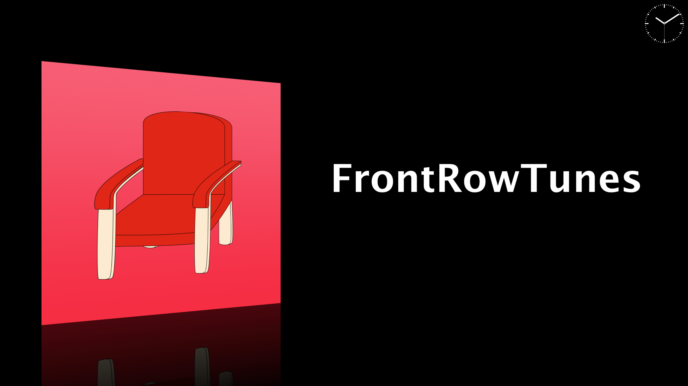

# FrontRowTunes

After FrontRow was removed in Mac OS X 10.7 Lion, in 2013 I decided to build a little app that brings back a FrontRow-like music experience, but for music playing in iTunes. Later updated to support the Music app instead.

## Features

- Show currently playing track with album art
- Animated with Core Animation, e.g. on track change
- Press [ W ] to turn background white, [ B ] to turn it black
- Press [ F ] to toggle between full-screen and windowed mode
- Press space to play/pause, arrow keys to select next/previous track
- Display current playback progress as position bar and/or position as mm:ss - press [ ↵ ] or [ fn ] [ ↵ ] to toggle through options.
- Clock (analog or digital) - press [ T ] to toggle through options or [ shift ] [ T ] to hide the clock completely
- Press [ option ] [ T ] to show a full-screen clock instead of currently playing track
- In-app tutorial shown on first launch - press [ I ] or [ H ] to invoke it again
