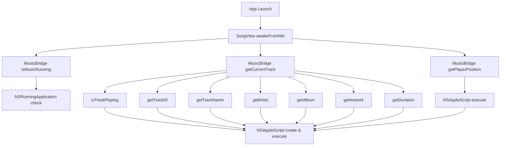

# Static Code Analysis Results

## Confirmed by Static Analysis

### Call Sites & Startup Sequence
- **Startup Path:** `App Launch` $
ightarrow$ `SongView awakeFromNib`.
- **Startup Calls to `MusicBridge`:**
    - `[MusicBridge isMusicRunning]`: Checks if Music app is running using `NSRunningApplication` (Fast, no AppleScript).
    - `[MusicBridge getPlayerPosition]`: Synchronous AppleScript call on the main thread.
    - `[MusicBridge getCurrentTrack]`: Synchronous call on the main thread that triggers **multiple** sequential AppleScript calls (Very Slow).

### `MusicBridge` Implementation
- **Mechanism:** Uses `NSAppleScript` for all communication with the Music app.
- **AppleScript Lifecycle:** `NSAppleScript` instances are created and compiled from source strings **on every single invocation** within `executeScript(source:)`. There is no caching of scripts or compiled objects.
- **Synchronous Nature:** All `MusicBridge` methods are synchronous. The bridge does not perform any internal dispatching to background queues.
- **AppleEvent Methods:** Every method except `isMusicRunning` executes AppleScript/AppleEvents.

### Threading & UI Lifecycle
- **Main Thread Blocking:** Calls in `awakeFromNib` and the distributed notification observer `getTrack:` execute on the main thread, blocking the UI until the AppleScript returns.
- **Asynchronous Exceptions:** `SongView` explicitly wraps calls to `[MusicBridge getPlayerState]` in `dispatch_async(dispatch_get_global_queue(...))` in `setupLayers`, `getTrack:`, `setTrack:prev:`, and `handleEventTimeout`.
- **Notification-Driven Updates:** The application observes `com.apple.Music.playerInfo` via `NSDistributedNotificationCenter`. When received, `getTrack:` is called on the main thread, which then calls the expensive `[MusicBridge getCurrentTrack]`.

### Timers & Polling
- **`updatePlayerPositionTimer`**: Created in `SongView awakeFromNib` with `UPDATEINTERVAL`. It invokes `updatePlayerPosition`. In the current source, `updatePlayerPosition` has the `MusicBridge` query commented out/removed and only calls `[activeSongLayer updateClock]`.
- **Polling Dependencies:** Most metadata updates (track name, artist, etc.) are driven by the `com.apple.Music.playerInfo` notification, but the initial state is set via polling in `awakeFromNib`.

### Music App Detection
- **Existing Detection:** `[MusicBridge isMusicRunning]` uses `NSRunningApplication(withBundleIdentifier: "com.apple.Music")` to check for the process.

## Requires Runtime Verification
- **Exact Latency:** The precise time cost of each individual AppleScript call (e.g., `getArtwork` vs `getTrackID`).
- **Notification Frequency:** How often `com.apple.Music.playerInfo` is fired and if it causes stuttering during playback.
- **Startup Impact:** The cumulative delay added to the app's "time-to-visible" by the synchronous calls in `awakeFromNib`.

## Startup Call Graph

